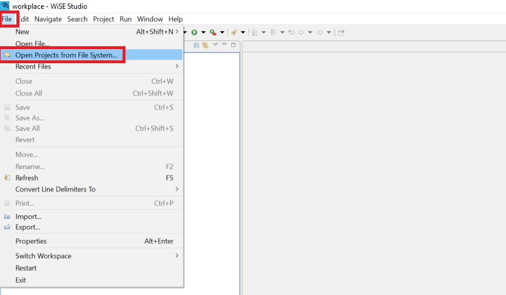
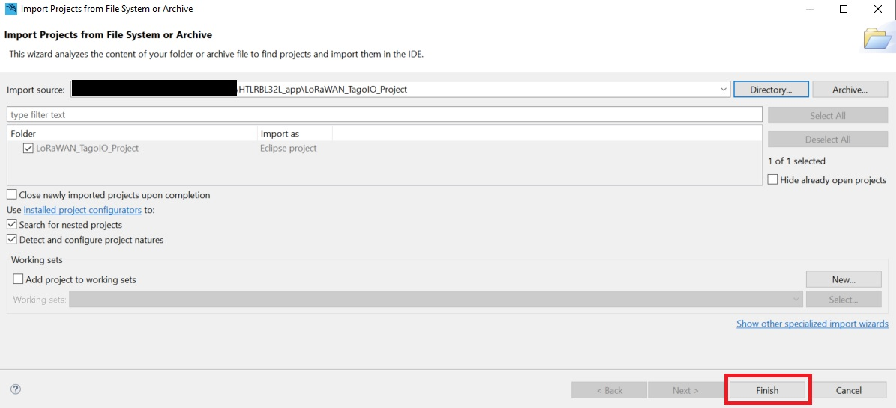
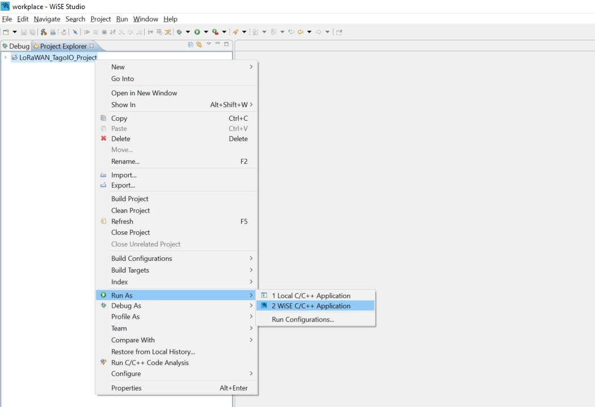

# HTLRBL32- Web Platform (TagoIO)

- TTN gateway config. tutorial.
- PicoGW_UI config. Tutorial.
- FW channels config. tutorial.


## Web Platform Monitoring Application

Web Platform Monitoring Application is a web interface example which presents the data received from a HTLRBL32 device in a LoRaWAN network (The Things Network) in a cloud interface service (TagoIO). 

Through this application, users will be able to create their own LoRaWAN web platform interface.

## Application Description

Web Platform Monitoring Application starts configuring some necessary peripherals, like USART1 (log purposes), GPIOs (radio interruption, etc.) and I2C (communication with HTS221 and LSP22HB sensors). 

More code details can be found reading the comments written in all header files available in this application.

## Test Setup

This section describes the basic test setup to running this application.

* [Git](https://git-scm.com/downloads).
* [RF-Flasher Utility](https://www.st.com/en/embedded-software/stsw-bnrgflasher.html).
* [WiSE-Studio IDE](https://www.st.com/en/embedded-software/stsw-wise-studio.html).
* [PicoGW_UI](https://semtech.my.salesforce.com/sfc/p/#E0000000JelG/a/2R000000HUez/K0A_bK5uBvhvUjw3NULc7Fl9G3i34tgEa6k45TCzV3E) Software.
* RS232 terminal ([Termite](https://www.compuphase.com/software_termite.htm) is recommended).
* [ST-Link Debugger](https://www.st.com/en/development-tools/st-link-v2.html) to flash a firmware.
* HTLRBL32 device.
* Semtech SX1308 LoRa® Gateway.
* HTS221 (temperature and humidity) and LSP22HB (pressure) I2C sensors.
* FTDI (usb-serial converter – one for each device).

# Configuring PicoGW_UI


# Executing

1. Set your LoRaWAN keys (OTAA and/or ABP): <br/>

- Flash the binary "[HTLRBL32L_Provisioner.bin](https://github.com/htmicron/htlrbl32l/tree/SDK/Applications/Binaries)" using "[RF-Flasher Utility](https://www.st.com/en/embedded-software/stsw-bnrgflasher.html)".
- Follow the instructions at the "[HTLRBL32L_Key_Provisioner_Manual](https://github.com/htmicron/htlrbl32l/tree/SDK/Key_Provisioner/Documentation)"
- Save your setted keys to configure the TagoIO device later.

2. Clone the master branch: <br/>

```
git clone --single-branch --branch master_2 https://github.com/htmicron/HTLRBL32L_app.git
```

3. Open WiSE-Studio IDE. 
4. Click in "File->Open Projects from File System...": <br/>

<div align="center">
  
</div>

<br/>

5. Click in "Directory...", find and select your cloned folder "HTLRBL32L_app/LoRaWAN_TagoIO_Project" then click "Finish" to open project. <br/>

<div align="center">
  
</div>

<br/>

6. Right click the project in the project explorer, then click "Run As...-> Wise C/C++ Application" to build and flash the new firmware into your device: <br/>

<div align="center">
  
</div>

<br/>

7. Open Termite and reset your device to check if the initial string was printed on serial. <br/>

<div align="center">
  
</div>

# The Things Network (TTN) Configuration

- Create a TTN account at "[TTN website](https://www.thethingsnetwork.org/)" and follow "[Adding TTN gateway guide](https://git-scm.com/downloads)" steps to add a new gateway. <br/>

# TagoIO Configuration 

## New Device

- Create a TagoIO account at "[TagoIO website](https://tago.io/)". <br/>
- Add a new device:

<div align="center">
  
</div>

- Look for "Custom The Things Industries" network and select it:

<div align="center">
  
</div> 

- Add the Device EUI saved before and create the device:

<div align="center">
  
</div>

## Payload Parser Code

- Open the created device:

<div align="center">
  
</div>

- Select "Payload Parser" tab and copy the code from "[Payload Parser Code](https://github.com/henriquekuhn/HTLRBL32/blob/main/Applications/Lora%20TagoIO%20interface/Payload%20Parser%20Code.txt)".

<div align="center">
  
</div>

- Create a Dashboard by following the TagoIO documentation: "[Dashboard Overview](https://docs.tago.io/en/articles/15-dashboard-overview)".

<div align="center">
  
</div>


## Extra Documentation

Datasheets and application notes can be found at [HTLRBL32 Repository](https://github.com/htmicron/ht32sx).

## References

For additional information:

* [HTLRBL32 datasheet](https://www.st.com/resource/en/datasheet/hts221.pdf).
* [HTS221 datasheet](https://www.st.com/resource/en/datasheet/hts221.pdf). 
* [LSP22HB datasheet](https://www.st.com/resource/en/application_note/an5209-lps22hh-mems-nano-pressure-sensor-stmicroelectronics.pdf).
* [Semtech SX1308 LoRa® Gateway datasheet](https://www.mouser.com/datasheet/2/761/sx1308-1277867.pdf).


## Contact Information

Head Office – São Leopoldo, RS <br/>
HT Micron Semiconductors <br/>
Unisinos Avenue, 1550 <br/>
São Leopoldo - RS <br/>
ZIP 93022-750 <br/>
Brazil <br/>
Tel: +55 51 3081-8650 <br/>
E-mail (Support): support_iot@htmicron.com.br <br/>
E-mail (General Enquiries): htmicron@htmicron.com.b <br/>
