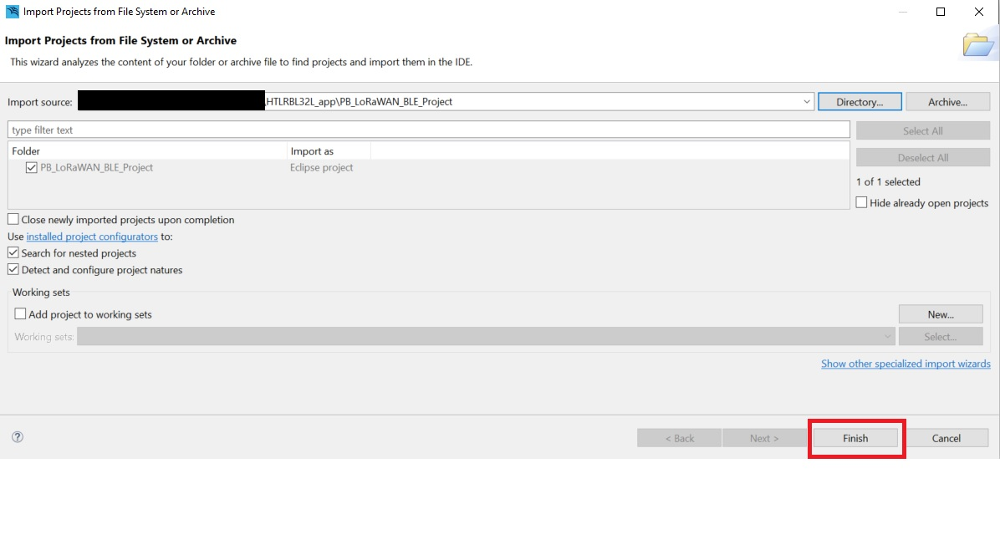
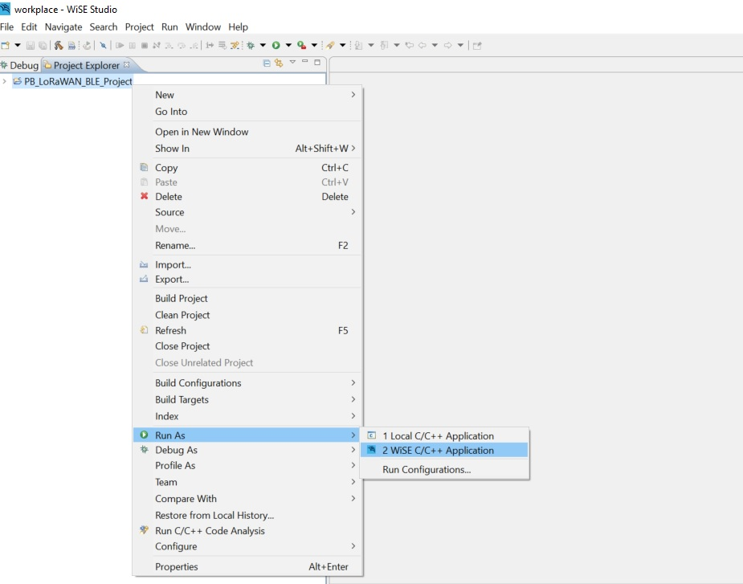
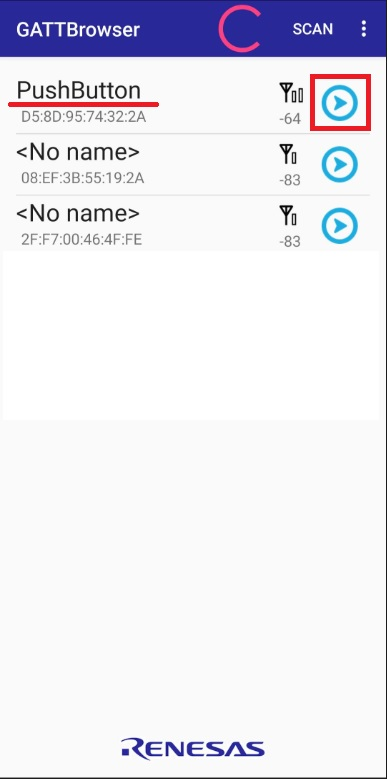
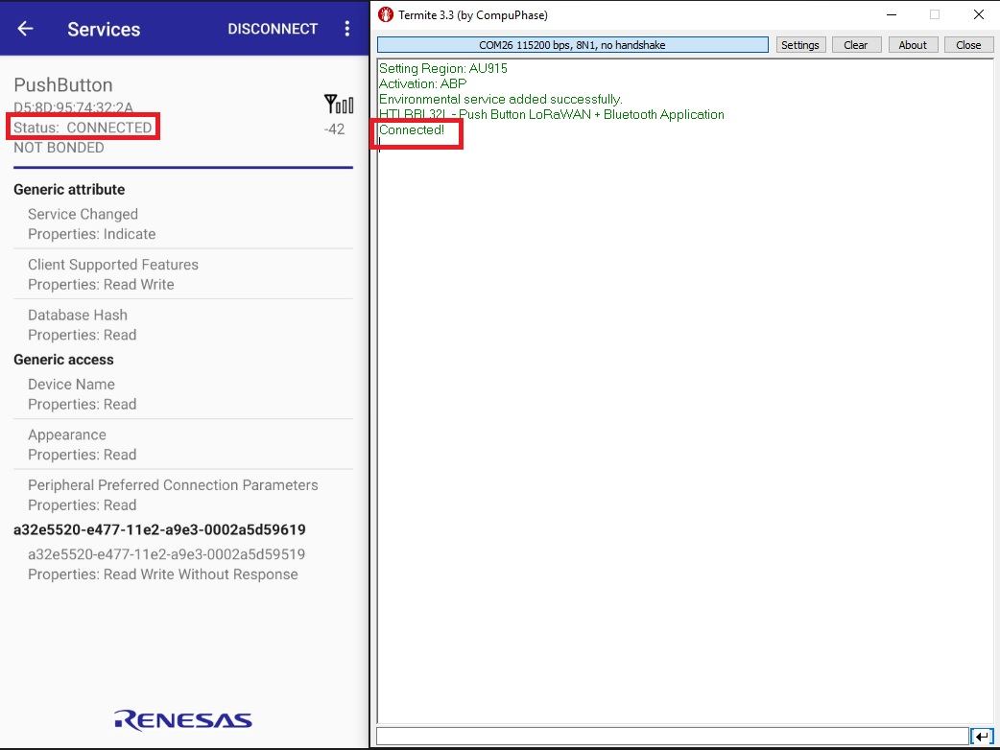
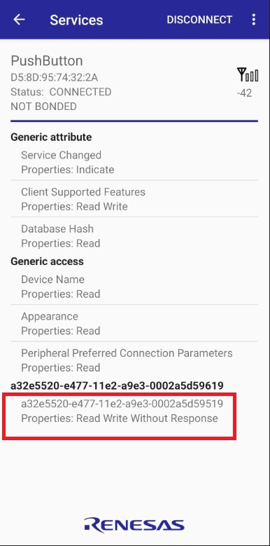
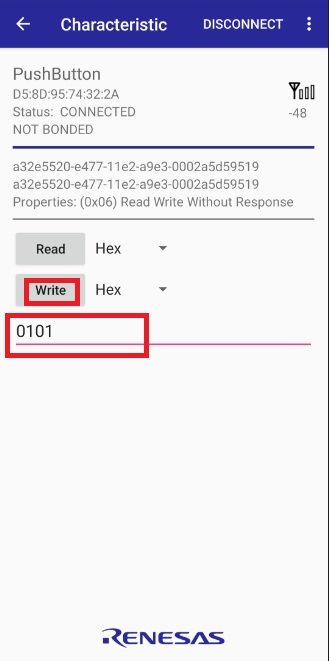
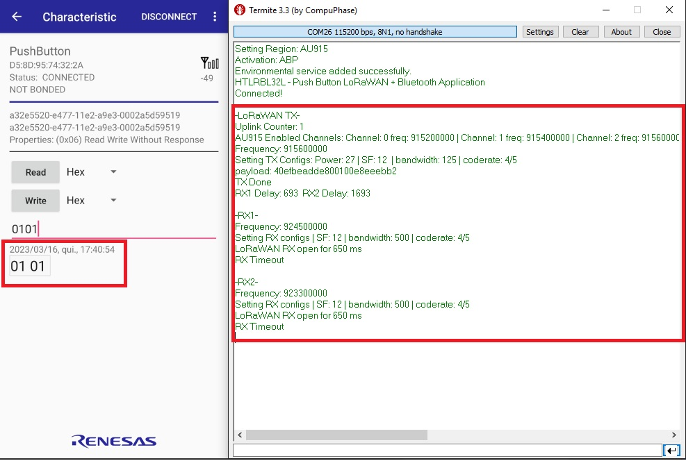

# HTLRBL32- Push button LoRaWAN Bluetooth 

- TTN gateway config. tutorial.
- FW channels config. tutorial.
- GATTbrowser config. tutorial.

## Application Description

This application works using the andriod app GATTbrowser to, connected via bluetooth with the device, write the payload and send LoRa packets to the server.

The firmware configures some necessary peripherals, like USART1 (log purposes), GPIOs (radio interruption, etc.) and I2C (STsafe). 

More code details can be found reading the comments written in all header files available in this application.

## Test Setup

This section describes the basic test setup to running this application.

* [Git](https://git-scm.com/downloads).
* [RF-Flasher Utility](https://www.st.com/en/embedded-software/stsw-bnrgflasher.html).
* [WiSE-Studio IDE](https://www.st.com/en/embedded-software/stsw-wise-studio.html).
* RS232 terminal ([Termite](https://www.compuphase.com/software_termite.htm) is recommended).
* [ST-Link Debugger](https://www.st.com/en/development-tools/st-link-v2.html) to flash a firmware.
* [GATTbrowser android app](https://play.google.com/store/apps/details?id=com.renesas.ble.gattbrowser).
* HTLRBL32 device.
* Semtech SX1308 LoRa® Gateway.
* FTDI (usb-serial converter – one for each device).

# Executing

1. Set your LoRaWAN keys (OTAA and/or ABP): <br/>

- Flash the binary "[HTLRBL32L_Provisioner.bin](https://github.com/htmicron/htlrbl32l/tree/SDK/Applications/Binaries)" using "[RF-Flasher Utility](https://www.st.com/en/embedded-software/stsw-bnrgflasher.html)".
- Follow the instructions at the "[HTLRBL32L_Key_Provisioner_Manual](https://github.com/htmicron/htlrbl32l/tree/SDK/Key_Provisioner/Documentation)"
- Save your setted keys to configure the TTN device later.

2. Clone the master branch: <br/>

```
git clone --single-branch --branch master_2 https://github.com/htmicron/HTLRBL32L_app.git
```

3. Open WiSE-Studio IDE. 
4. Click in "File->Open Projects from File System...": <br/>

<div align="center">
  
</div>

<br/>

5. Click in "Directory...", find and select your cloned folder "HTLRBL32L_app/PB_LoRaWAN_BLE_Project" then click "Finish" to open project. <br/>

<div align="center">
  
</div>

<br/>

6. Right click the project in the project explorer, then click "Run As...-> Wise C/C++ Application" to build and flash the new firmware into your device: <br/>

<div align="center">
  
</div>

<br/>

7. Open Termite and reset your device to check if the initial string was printed on serial. <br/>

<div align="center">
  
</div>

<br/>

# The Things Network (TTN) Configuration

- Create a TTN account at "[TTN website](https://www.thethingsnetwork.org/)" and follow the "[guide](https://www.thethingsnetwork.org/docs/gateways/)" to your gateway. <br/>
- Use the keys you set earlier to add your device in the TTN network.

# GATTbrowser

- Download [GATTbrowser android app](https://play.google.com/store/apps/details?id=com.renesas.ble.gattbrowser).
- Open the app and click to open the PushButton device: <br/>

<div align="center">
  
</div>

<br/>

- Once the device is connected: <br/>

<div align="center">
  
</div>

<br/>

- Click here to go into the read/write page: <br/>

<div align="center">
  
</div>

<br/>

- You can choose between a string and hexadecimal payload. Write the payload as the picture and click the write button: <br/>

<div align="center">
  
</div>

<br/>

- You sent this payload via LoRaWAN to your TTN network server. <br/>

<div align="center">
  
</div>

<br/> 

## Extra Documentation

Datasheets and application notes can be found at [HTLRBL32 Repository](https://github.com/htmicron/ht32sx).

## References

For additional information:

* [HTLRBL32 datasheet](https://www.st.com/resource/en/datasheet/hts221.pdf).
* [Semtech SX1308 LoRa® Gateway datasheet](https://www.mouser.com/datasheet/2/761/sx1308-1277867.pdf).


## Contact Information

Head Office – São Leopoldo, RS <br/>
HT Micron Semiconductors <br/>
Unisinos Avenue, 1550 <br/>
São Leopoldo - RS <br/>
ZIP 93022-750 <br/>
Brazil <br/>
Tel: +55 51 3081-8650 <br/>
E-mail (Support): support_iot@htmicron.com.br <br/>
E-mail (General Enquiries): htmicron@htmicron.com.b <br/>
