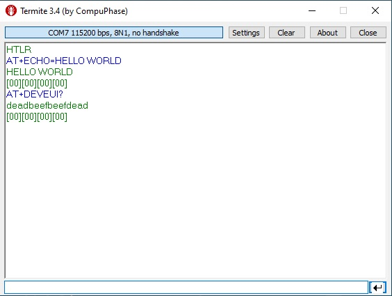

# HTLRBL32 - AT Commands

#TODO
- Add link to gateway config. tutorial.
- Add application description.
- Add link to HTLRBL32L datasheet in "Extra Documentation" and "References".


## AT Commands Application

AT Commands Application is an example which allows interfacing with HTLRBL32 via serial port using AT commands for altering LoRa configurations and interacting with LoRaWAN manually. 

Through this application, users will be able to see the HTLRBL32L SiP's LoRa functionalities in step-by-step form.

## Application Description

//////Web Platform Monitoring Application starts configuring some necessary peripherals, like USART1 (log purposes), GPIOs (radio interruption, etc.) and I2C (communication with HTS221 and LSP22HB sensors). 
///////
//////More code details can be found reading the comments written in all header files available in this application.

## Test Setup

This section describes the basic test setup to running this application.

* [Git](https://git-scm.com/downloads).
* [uVision IDE](https://www2.keil.com/mdk5) or [WiSE Studio IDE](https://www.st.com/en/embedded-software/stsw-wise-studio.html#get-software).
* [PicoGW_UI](https://semtech.my.salesforce.com/sfc/p/#E0000000JelG/a/2R000000HUez/K0A_bK5uBvhvUjw3NULc7Fl9G3i34tgEa6k45TCzV3E) Software.
* RS232 terminal ([Termite](https://www.compuphase.com/software_termite.htm) is recommended).
* [ST-Link Debugger](https://www.st.com/en/development-tools/st-link-v2.html) to flash a firmware.
* HTLRBL32L device.
* Semtech SX1308 LoRa® Gateway.

# Configuring PicoGW_UI


# Executing

1. Clone the master branch: <br/>

```
git clone --single-branch --branch SDK https://github.com/htmicron/htlrbl32l.git
```

2. Depending on what IDE you are using:
    - If you are using uVision IDE, open "HTLRBL32L_AT_Commands\AT-Commands\MDK-ARM\HTLRBL32L" directory and then, double click htlrbl32l-lorawan-base.uvprojx file to open uVision. <br/>

    - If you are using WiSE Studio IDE, open the program, import an existing project to your workspace (File -> Import -> General -> Existing Projects into Workspace) and insert the application's WiSE-Studio directory path in the root directory field (HTLRBL32L_AT_Commands\AT-Commands\WiSE-Studio). <br/>


3. Click *Build* to compile and *Load*/*Run* to flash the new firmware into your device: <br/>

<div align="center">
  
</div>

<div align="center">
  
</div>

<br/>

5. Open Termite and reset your device to check if the initial string ("HTLR") was printed on serial. <br/>

<div align="center">
  
</div>

6. For more details on what AT Commands are available and how to use them, check the "AT-Commands Specification" document found in "HTLRBL32L_AT_Commands\Documentation".


# The Things Network (TTN) Configuration

- Create a TTN account at "[TTN website](https://www.thethingsnetwork.org/)" and follow "[Adding TTN gateway guide](https://www.thethingsindustries.com/docs/gateways/adding-gateways/)" steps to add a new gateway. <br/>
- Add the end device which will run this application to TTN. You can follow the "[Adding Devices](https://www.thethingsindustries.com/docs/devices/adding-devices/)" guide to do so.


## Extra Documentation

//////Datasheets and application notes can be found at [HTLRBL32 Repository](https://github.com/htmicron/ht32sx).

## References

For additional information:

//////* [HTLRBL32 datasheet](https://www.st.com/resource/en/datasheet/hts221.pdf).
* [Semtech SX1308 LoRa® Gateway datasheet](https://www.mouser.com/datasheet/2/761/sx1308-1277867.pdf).


## Contact Information

Head Office – São Leopoldo, RS <br/>
HT Micron Semiconductors <br/>
Unisinos Avenue, 1550 <br/>
São Leopoldo - RS <br/>
ZIP 93022-750 <br/>
Brazil <br/>
Tel: +55 51 3081-8650 <br/>
E-mail (Support): support_iot@htmicron.com.br <br/>
E-mail (General Enquiries): htmicron@htmicron.com.br <br/>
