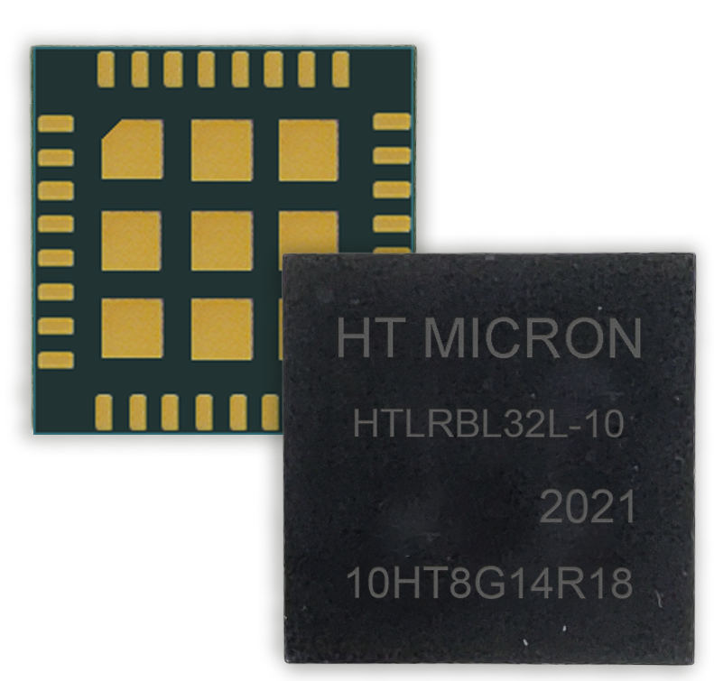

# iMCP HTLRBL32L - New System-in-Package LoRa® e Bluetooth®

  

 

Designed and manufactured in Brazil, the chip (iMCP HTLRBL32L) uses two communication protocols: LoRa® & Bluetooth®. Integrated within a small footprint 13x13x1.1mm chip, these connectivities are ready-to-use, just add a battery and an antenna to the chip to get an IoT device.

The release of System-in-package iMCP HTLRBL32L with LoRa® & Bluetooth® will take place in October 2021.

Register your interest in iMCP - HTLRBL32L in the form: https://forms.office.com/r/SkE4svVegb

 

## Interested in our device?

Please contact our commercial department: imcp@htmicron.com.br