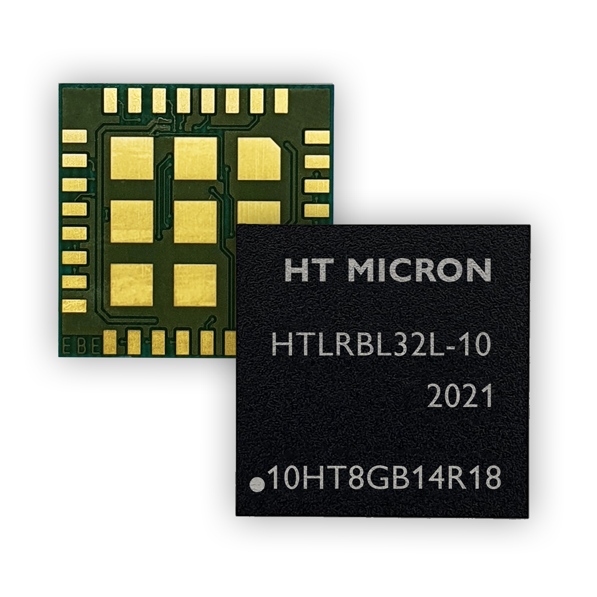
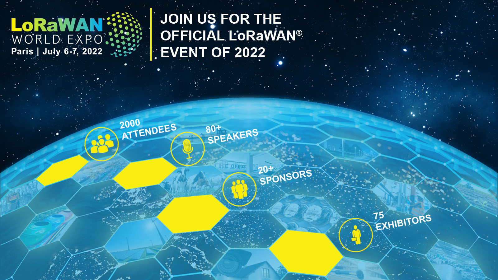

# iMCP HTLRBL32L - New System-in-Package LoRa® & Bluetooth Low Energy®

  

 

Designed and manufactured in Brazil, the chip (iMCP HTLRBL32L) uses two communication protocols: LoRa® & Bluetooth®. Integrated within a small footprint 13x13x1.1mm chip, these connectivities are ready-to-use, just add a battery and an antenna to the chip to get an IoT device.

Register your interest in iMCP - HTLRBL32L in the form: https://forms.office.com/r/nvTXCTS5je

 

# LoRaWAN World Expo 2022

  

 

* [iMCP HTLRBL32L - Databrief](https://github.com/htmicron/htlrbl32l/blob/LoRaWAN_Expo2022/Documents/Data%20Brief.pdf)
* [iMCP HTLRBL32L - Flyer](https://github.com/htmicron/htlrbl32l/blob/LoRaWAN_Expo2022/Documents/HT%20Micron_iMCP%20HTLRBL32L-SiPLoRaBluetooth.pdf)
* [IPv6 over LoRaWAN with Acklio SCH - iMCP HTLRBL32L](https://github.com/htmicron/htlrbl32l/blob/LoRaWAN_Expo2022/Documents/ACKLIO-SCHConHT%20MicroniMCPHTLRBL32L.pdf)

 

## iMCP HTLRBL32L - SDK

 

* iMCP HTLRBL32L Firmware Examples and documentation: [**HERE**](https://github.com/htmicron/htlrbl32l/tree/SDK)
* Evaluation board PCB designs [**HERE**](https://github.com/htmicron/htlrbl32l/tree/documents)
 

## Interested in our device?

Please contact our commercial department: imcp@htmicron.com.br
